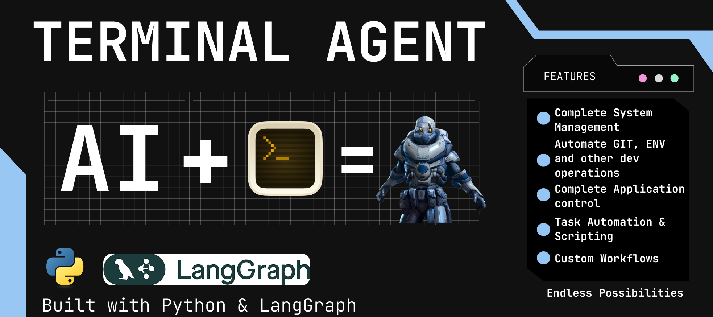

# Terminal Agent



A powerful Terminal Agent built with Python, LangGraph, and LangChain, designed for seamless command execution across multiple operating systems. Available as both a **CLI application** and a **modern web interface** with real-time streaming.

## 🌟 Features

### Core Capabilities
- **Complete System Management**: Handle processes, files, directories, system info, resource usage, settings, and task scheduling
- **Automate GIT, ENV, and Other Dev Operations**: Initialize Git repos, manage virtual environments, install packages, run build scripts, and debug code
- **Complete Application Control**: Launch and automate applications, manage services, and software
- **Task Automation & Scripting**: Write and run scripts, automate repetitive tasks like backups or log management
- **Custom Workflows**: Create integrations, monitor system status, and send alerts
- **Networking**: Manage adapters, query configurations, and run diagnostics like ping or traceroute
- **Security**: Manage system security tools and check for vulnerabilities

### Web Interface Features
- 🤖 **AI-Powered Terminal Assistant**: Uses LangGraph and Google Gemini (FREE!)
- 💻 **PowerShell Integration**: Direct PowerShell command execution through the web interface
- 🌐 **Modern Web UI**: Beautiful, responsive terminal-like interface
- 🔄 **Real-time Streaming**: Live streaming of AI responses and command outputs
- 📱 **Responsive Design**: Works on desktop and mobile devices
- 🔒 **Session Management**: Maintains conversation history and PowerShell session state
- ⚡ **Fast & Efficient**: Optimized for quick command execution and response

## 🚀 Quick Start

### Prerequisites
- Python 3.8+
- Windows OS (for PowerShell support)
- Google Gemini API key (FREE!)

### Installation

1. **Clone the repository**
   ```bash
   git clone https://github.com/sriram-dev-9/Terminal-Agent.git
   cd Terminal-Agent
   ```

2. **Install dependencies**
   ```bash
   pip install -r requirements.txt
   ```

3. **Get your FREE Gemini API key**
   - Go to: https://makersuite.google.com/app/apikey
   - Sign in with Google account
   - Click "Create API Key"
   - Copy the key (starts with `AIza...`)

4. **Configure API key**
   ```bash
   # Edit .env file and add your Gemini API key
   GEMINI_API_KEY=AIza-your-actual-key-here
   ```

## 💻 Usage

### Web Interface (Recommended)

1. **Start the web server**
   ```bash
   python run.py
   ```

2. **Open your browser**
   Navigate to: `http://localhost:5000`

3. **Start using Terminal Agent!**
   - Type PowerShell commands or natural language requests
   - See real-time streaming responses
   - Use keyboard shortcuts (Ctrl+L to clear, Ctrl+K to clear input)

### CLI Interface

1. **Run the CLI version**
   ```bash
   python main.py
   ```

2. **Enter commands when prompted**
   Type `exit` to quit

## 🏗️ Architecture

### Web Application Structure
```
Terminal Agent Web
├── Backend (Flask API)
│   ├── /api/chat - Handle chat requests
│   ├── /api/stream - Stream responses in real-time
│   ├── /api/clear - Clear conversation history
│   └── /api/status - Check API status
├── Frontend (HTML/JavaScript)
│   ├── Terminal-like interface
│   ├── Real-time streaming
│   └── Responsive design
└── Core Components
    ├── LangGraph agent
    ├── PowerShell process management
    └── Tool integration
```

### Project Structure
```
Terminal-Agent/
├── 🌐 Web Application
│   ├── app.py                     # Flask application (Gemini)
│   ├── config.py                  # Configuration management
│   ├── run.py                     # Startup script
│   └── requirements.txt           # Dependencies
│
├── 💻 CLI Application
│   ├── main.py                    # CLI version
│   └── terminal_controller.py     # PowerShell process management
│
├── 🎨 Frontend Assets
│   ├── templates/index.html       # Web interface
│   └── static/
│       ├── css/terminal.css       # Terminal styling
│       └── js/terminal.js         # Frontend JavaScript
│
└── 🔑 Configuration
    └── .env                       # API key configuration
```

## 🔧 Configuration

### Environment Variables

| Variable | Description | Default |
|----------|-------------|---------|
| `GEMINI_API_KEY` | Google Gemini API key (FREE!) | Required |
| `GEMINI_MODEL` | Gemini model to use | `gemini-1.5-flash` |
| `DEBUG` | Enable debug mode | `True` |
| `HOST` | Server host | `0.0.0.0` |
| `PORT` | Server port | `5000` |

### API Endpoints (Web Interface)

#### POST `/api/chat`
Send a message and get a response.

**Request:**
```json
{
  "message": "List all files in the current directory"
}
```

#### POST `/api/stream`
Stream responses in real-time.

#### POST `/api/clear`
Clear conversation history.

#### GET `/api/status`
Check API status.

## 🌍 Cross-Platform Support

While the Terminal Agent is configured for Windows with PowerShell by default, it can be adapted to work on Linux or macOS by modifying the shell used in `terminal_controller.py`. To switch to `bash`:

1. Open `terminal_controller.py`
2. Update the `subprocess.Popen` call to use `bash` instead of `powershell.exe`
3. Adjust the agent's logic to use bash commands instead of PowerShell commands

> Note: Some commands and features are Windows-specific and will need alternative implementations for other operating systems.

## 🔄 Using Different AI Models

The Terminal Agent is configured to use Google Gemini by default (FREE!), but you can easily switch to other providers:

### OpenAI
```python
from langchain_openai import ChatOpenAI

llm = ChatOpenAI(
    model_name="gpt-4o-mini",
    api_key="your-openai-key"
).bind_tools(tools)
```

### Anthropic Claude
```python
from langchain_anthropic import ChatAnthropic

llm = ChatAnthropic(
    model_name="claude-3-sonnet-20240229",
    anthropic_api_key="your-anthropic-key"
).bind_tools(tools)
```

### Local Models (Ollama)
```python
from langchain_community.llms import Ollama

llm = Ollama(model="llama3.2").bind_tools(tools)
```

## 🛠️ Development

### Adding New Features

1. **New API Endpoints**: Add routes to `app.py`
2. **UI Enhancements**: Modify `templates/index.html`
3. **New Tools**: Add tools to the LangGraph agent
4. **Styling**: Update `static/css/terminal.css`

### Testing

```bash
# Test the API
curl -X POST http://localhost:5000/api/chat \
  -H "Content-Type: application/json" \
  -d '{"message": "Get-Process"}'

# Test streaming
curl -X POST http://localhost:5000/api/stream \
  -H "Content-Type: application/json" \
  -d '{"message": "dir"}'
```

## 🚀 Deployment

### Local Development
```bash
python run.py
```

### Production
- Use Gunicorn or uWSGI for production
- Set `DEBUG=False` in environment
- Configure proper security settings
- Use HTTPS in production

## 🤝 Contributing

Contributions are welcome! Please fork the repository, create a new branch, and submit a pull request with your changes.

## 📄 License

This project is licensed under the MIT License - see the LICENSE file for details.

## 🙏 Acknowledgments

- Built with LangGraph and LangChain
- Powered by Google Gemini (FREE!)
- Inspired by the need for efficient terminal automation across operating systems

## 🆘 Support

For issues and questions:
- Check the logs in `terminal_agent.log`
- Verify your API key configuration
- Ensure PowerShell is available on Windows
- Check the troubleshooting section above